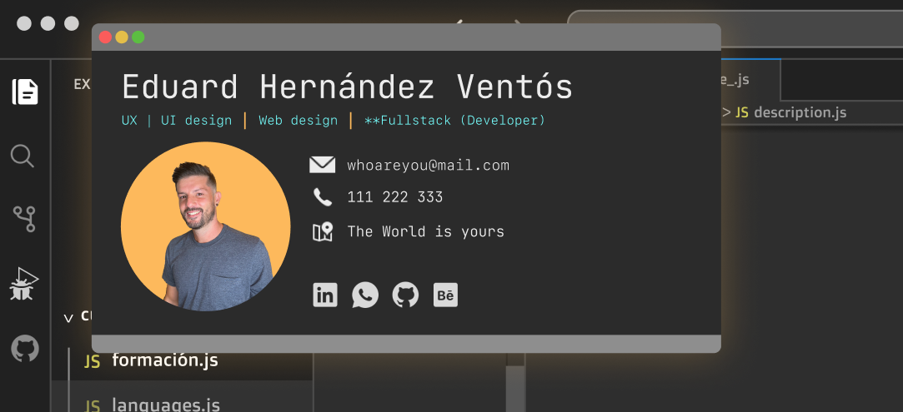

# Resume

Resume is a project designed as an online portfolio and resume, with a user interface inspired by Visual Studio Code. The goal is to showcase your work experience, technical skills, and featured projects in an interactive and visually appealing way.

## Features

Unique Visual Style: A layout that emulates the Visual Studio Code environment.
- Contact details.
- Work experience.
- Technical skills.
- Featured projects (Full-Stack and Front-End).
- Academic background.
- Interactivity: Responsive design with smooth animations to enhance user experience.

### UX | UI Design
)

## Technical

### Blocks

- App (user interface)
- API (core logic) (coming soon..)
- DB (data storage) (coming soon..)

### Technologies

- HTML / CSS / JS
- React
- TailwindCSS
- Node
- Vite
- Visual Studio Code
- Vim
- Figma

### Deployment

- Resume hosted on Vercel
- Check it out live: [resume project](https://eduardhernandez.vercel.app/)
